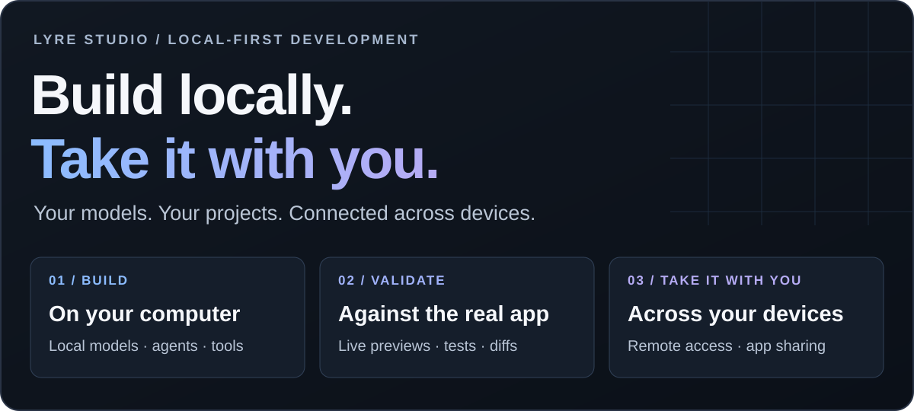
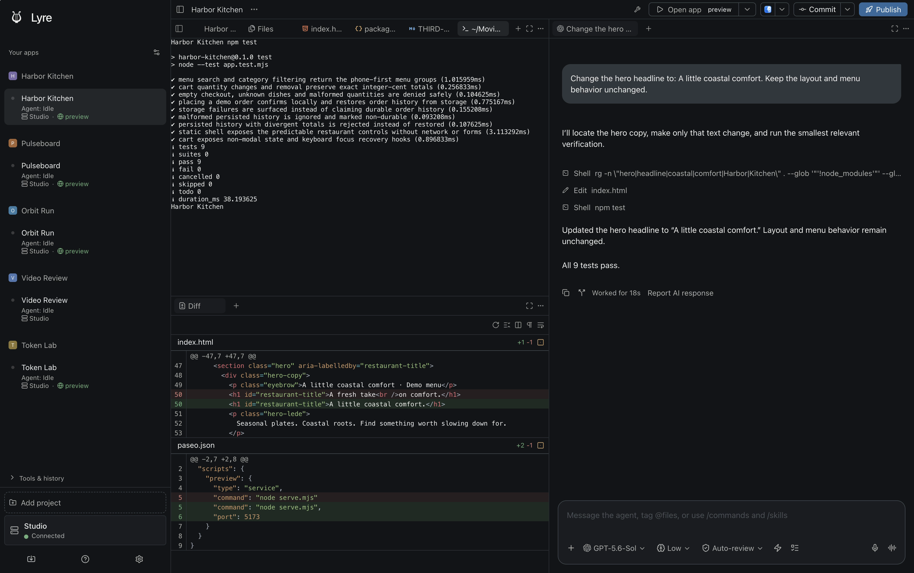

  

<h1 align="center">Lyre Studio</h1>

<strong>Your models. Your computer. Your work, on the go.</strong>

  Build with coding agents and local models. Run, test, and preview your apps. 
  Orchestrate across models and devices, from one workspace that travels with you.

  
  
  

  <a href="#download"><strong>Download Lyre</strong></a> ·
  <a href="#get-started">Quick start</a> ·
  <a href="https://lyrestudio.net/docs/index.html">Documentation</a> ·
  <a href="https://github.com/LyreStudio/lyre-releases/releases">What's new</a>

  <picture>
    <source media="(max-width: 600px)" srcset="assets/lyre-workflow-mobile.svg">
    
  </picture>

## One workspace. From idea to app.

Lyre brings your development environment, AI agents, and running apps together. Start with
an idea or an existing project. Give work to the right model, follow the changes, run your
tests, and interact with the result. Then keep going from your phone or another computer.

  

Your agent and your working app, together. Actual Lyre interface with a sample project.

## Why Lyre?

| What you want to do | How Lyre helps |
| --- | --- |
| **Build with your own setup** | Open existing projects and use your computer's files, tools, services, and Git workflows. |
| **Put local models to work** | Discover and connect model servers, choose models, and use them in your agent workflow. |
| **Give each task the right model** | Coordinate supported agents, work in parallel, and use isolated worktrees for separate tasks. |
| **Take your apps with you** | Open live app previews from a paired device, at your desk or remotely. |
| **Know what actually works** | Review diffs, run project tests, inspect output, and validate the real app through interaction. |
| **Let others try what you built** | Share selected apps through revocable invitations with app-only access. |
| **Move from working app to release** | Use integrated Fastlane release tools, desktop publishing, and project-defined publish scripts. |

  <a href="#built-for-local-models-and-local-development">Local models</a> ·
  <a href="#orchestrate-across-models-and-devices">Orchestration</a> ·
  <a href="#take-your-apps-with-you">Remote previews</a> ·
  <a href="#build-test-validate-repeat">Testing</a> ·
  <a href="#bring-your-release-workflow-with-you">Release tools</a>

## Built for local models and local development

**Make the most of the computer and models you already have.** Lyre is built around your
local development environment: your repositories, dependencies, command-line tools, and
running services. Open a project folder and keep working with its existing setup.

Local models have their own discovery and setup experience. Find a running model server,
connect an endpoint, add a model to your selection, and check its availability from Lyre.
Use **Ollama, LM Studio, llama.cpp, or compatible model servers**, alongside supported
cloud providers and the optional managed **Lyre AI** service.

- **Your machine does the work.** Project services and local inference run on the selected host.
- **Your phone becomes a control surface.** Manage the connected host's model connections
  and steer its agents from a paired device.
- **Your tools stay useful.** Keep using your editor, terminal, Git history, and project scripts.
- **Start locally.** Local projects and local-network workflows work without a Lyre cloud account.

Choose where inference happens. Local models use your configured model server; cloud
providers receive the prompts and project context you send to them.

## Orchestrate across models and devices

**Use different strengths for different jobs.** Implement with one agent, investigate with
another, and bring a second model into the review. Lyre brings supported providers into a
shared workspace so you can follow tasks, direct the work, and inspect the results.

<strong>Claude Code · Codex · Copilot · OpenCode · Pi · Local models · Lyre AI</strong>

Run agents in parallel, give independent tasks their own Git worktrees, and keep agent
conversations beside the files and previews they affect. Connect to your hosts from
another screen to follow progress and provide the next instruction. Voice input lets you
dictate a task when typing is inconvenient.

### Paseo — agent orchestration across your machines

Lyre builds on [Paseo](https://github.com/getpaseo/paseo) for managing coding-agent sessions,
parallel work, and communication between hosts and clients. Lyre combines that orchestration
with its app library, local-model setup, service management, interactive previews, and
release tools. Your agents and your running apps share one development workspace.

### OmniRoute — more model choice through one connection

The built-in [OmniRoute](https://github.com/diegosouzapw/OmniRoute) integration brings your
configured gateway's model catalog into Lyre. Connect it in **Settings → OmniRoute**, select
a model, and use it through Lyre's Codex-backed agent workflow.

Use gateway routing to choose how requests reach your configured providers, including
automatic routes and fallback policies supported by your gateway. That gives you a single
connection for model choice while your project, agent conversation, and tools stay in Lyre.
The connection works with the OmniRoute gateway you run locally or at a configured address.

## Take your apps with you

**Build on your computer. Use what you build wherever you go.** A website, a dashboard,
a personal tool, or a browser game can become something you carry with you. Lyre connects
your paired devices to the app running on your host, so the real project is there to
open, interact with, and improve.

- **Live, interactive previews.** Tap buttons, fill in forms, try a workflow, and play
  through a game on the device in your hand.
- **Local and remote access.** Connect directly on your network or use Lyre's encrypted
  relay when you are away. Live app previews outside your network are included with Pro.
- **Development across screens.** Send a change from your phone, review the work, and
  return to the app to try the result.
- **Private app sharing.** Invite someone to a specific app with revocable, app-scoped
  access. Developer tools remain available to authorized developers.

  &nbsp;
  &nbsp;
  

Steer the agent. Try the website. Play the game. Real captures from Lyre's iPhone testing build.

Your host keeps the project running, so leave it awake and connected while you use your
apps remotely. Supported web workflows include React, Vite, Next.js, Expo web, and
Capacitor projects. [Explore project recipes](https://lyrestudio.net/docs/app-recipes.html).

## Build. Test. Validate. Repeat.

**Keep the feedback loop next to the work.** Lyre's Studio combines agent conversations,
source files, terminals, diffs, and app previews. Move from a proposed change to evidence
that it works, with the project's own tools and tests.

1. **Give a focused task.** Describe the result you want and let the agent work in the project.
2. **Review the change.** Inspect the files and diff alongside the conversation.
3. **Run the checks.** Execute the project's tests and inspect terminal output and diagnostics.
4. **Validate the experience.** Open the live app on desktop or a paired phone and try
   the actual interactions.
5. **Keep improving.** Feed what you find back into the same workspace.

  

Real project tests and code changes, visible alongside the agent that made them.

## Bring your release workflow with you

**Turn repeatable release work into a guided workflow.** Lyre brings publishing controls
into the project workspace, with checks for the configured tools, app identity, signing,
credentials, and build artifacts. Review the source and destination before running a release.

### Fastlane — signing, screenshots, testing tracks, and store uploads

Lyre integrates [Fastlane](https://github.com/fastlane/fastlane) through **14 curated release
actions**. They cover Android and iOS uploads, TestFlight, signing and provisioning,
screenshot capture and framing, store preflight checks, and build-version lookups.

Use the **Publish** flow and **Release tools** with your configured platform toolchain and
store accounts. Android publishing includes track selection and draft or submission choices;
iOS release tools connect to the Apple publishing workflow. Desktop projects can use their
electron-builder configuration, and custom projects can expose their own publish scripts.

The benefit is a connected path from development and validation into distribution,
with the release target and required setup visible in the workspace.

## How it works

| Part | What it does for you |
| --- | --- |
| **Your host computer** | Runs projects, development services, agent processes, and connected local models. |
| **Lyre Studio** | Brings your agents, source, terminals, previews, and release controls together. |
| **Your paired devices** | Let you follow work, direct agents, and interact with approved apps. |
| **Direct connection or encrypted relay** | Connects clients to your host locally or remotely. |
| **Your chosen providers and integrations** | Supply model inference, routing, and release tooling for your workflow. |

## Get started

1. **Install Lyre Studio** on the computer that will run your projects.
2. **Open a project folder** and configure its preview command and supporting services.
3. **Choose your models.** Connect a coding provider, add a local model, or use Lyre AI.
4. **Build and validate.** Start the preview, direct your agent, review the changes, and run your tests.
5. **Connect another screen.** Use **Pair Device** on the host, then open your approved
   project from the client.

[First-project walkthrough](https://lyrestudio.net/docs/quickstart.html) ·
[Existing-project setup](https://lyrestudio.net/docs/projects.html) ·
[Framework recipes](https://lyrestudio.net/docs/app-recipes.html)

## Download

| Platform | Get Lyre |
| --- | --- |
| **Windows · x64** | [Installer and portable ZIP](https://github.com/LyreStudio/lyre-releases/releases/latest) |
| **Linux · x64** | [AppImage, .deb, .rpm and .tar.gz](https://github.com/LyreStudio/lyre-releases/releases/latest) |
| **macOS** | [Downloads and rollout status](https://lyrestudio.net/#download) |
| **iOS & Android** | [Mobile testing and store availability](https://lyrestudio.net/docs/release-status.html#ios) |

Lyre is in early access. The screenshots show real desktop and iPhone testing builds;
platform and feature availability follow your installed build. See
[release notes](https://github.com/LyreStudio/lyre-releases/releases) and
[current availability](https://lyrestudio.net/docs/release-status.html) for downloads and
integration rollout details, including OmniRoute and platform-specific release tooling.

Installation details

Windows builds are currently unsigned and may display a SmartScreen warning.
Desktop releases include `SHA256SUMS.txt` for download verification. macOS rollout and
mobile store distribution are tracked in the release-status guide. Native mobile builds
use the platform's own toolchain and store requirements.

## Start free. Add what you need.

| Plan | What it brings to your workflow |
| --- | --- |
| **Free** | Local projects, local-network previews, remote connections, agent chat, code editing, and a daily voice allowance. |
| **Pro** | Live app previews outside your local network, team features, app-scoped invitations, and higher plan limits. |
| **Lyre AI** | Pro features plus managed AI access, alongside your own supported providers and local models. |

[See plans and current limits](https://lyrestudio.net/#pricing). External AI provider charges
are separate from your Lyre plan.

## Join the community

Share what you are building, suggest a workflow, or help us improve Lyre.

[Discord](https://discord.gg/ZRrY5DtZk) ·
[Report a bug](https://github.com/LyreStudio/lyre-releases/issues/new/choose) ·
[Documentation](https://lyrestudio.net/docs/index.html) ·
[Release notes](https://github.com/LyreStudio/lyre-releases/releases)

This repository is Lyre's public home for downloads, release notes, and issue reports.
Application source is maintained separately. Thanks to **Paseo, OmniRoute, Fastlane**,
and the open-source projects that help make Lyre possible.
[Third-party notices and licenses](https://lyrestudio.net/legal/third-party-licenses.html).

© 2026 Lyre · <a href="https://lyrestudio.net">Website</a> · <a href="https://lyrestudio.net/privacy.html">Privacy</a> · <a href="https://lyrestudio.net/docs/account-deletion.html">Account help</a>

