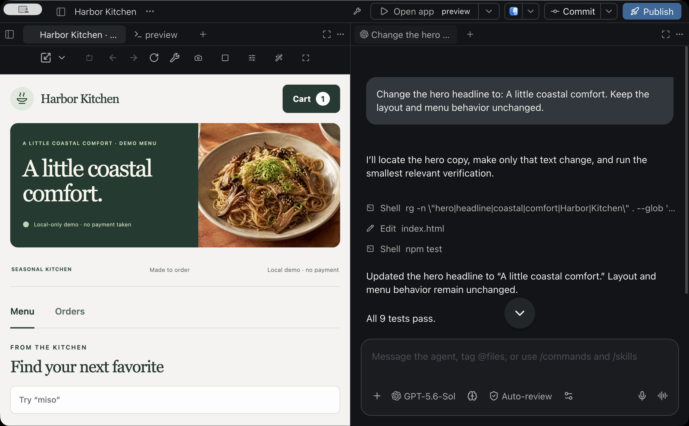
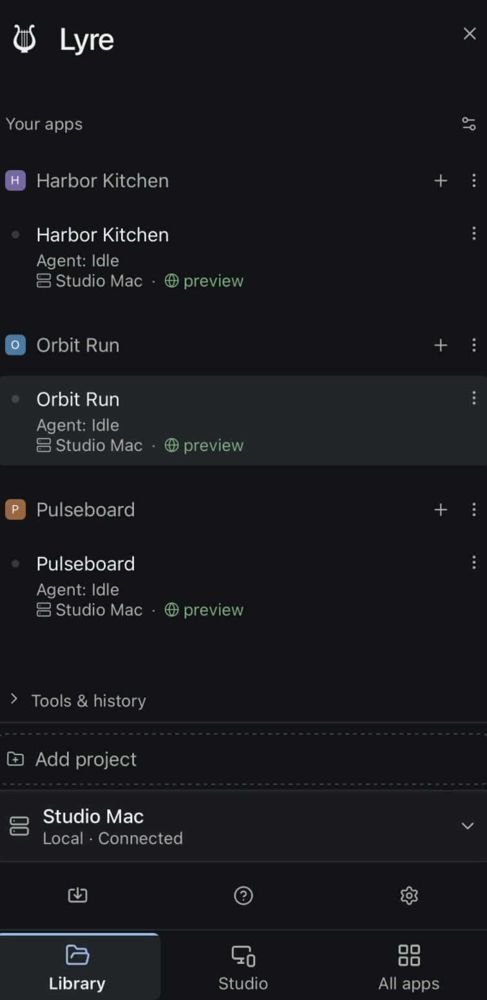
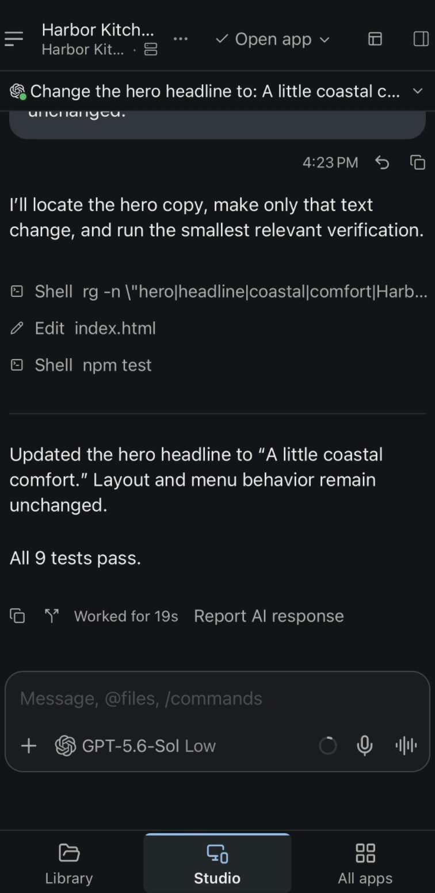
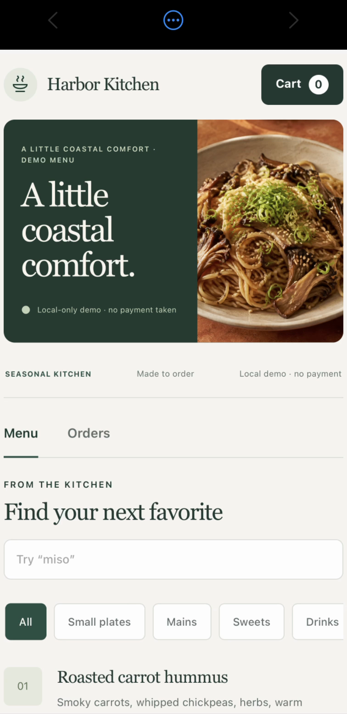

  

<h1 align="center">Lyre Studio</h1>

<strong>Build your idea. Try it on your phone.</strong>

  Your coding agents, project files, and live app preview in one workspace. 
  Work at your desk or connect from your phone while your computer runs the project.

  
  
  

  <a href="#download"><strong>Download</strong></a> ·
  <a href="#get-started">Quick start</a> ·
  <a href="https://lyrestudio.net/docs/index.html">Documentation</a> ·
  <a href="#integrations-with-a-purpose">Integrations</a> ·
  <a href="https://github.com/LyreStudio/lyre-releases/releases">Release notes</a>

  

Ask for a change, review the work, and try the result. Actual Lyre interface with a sample project.

## Download

Start with Lyre Studio on the computer that will run your projects.

| Platform | Get Lyre |
| --- | --- |
| **Windows · x64** | [Installer and portable ZIP](https://github.com/LyreStudio/lyre-releases/releases/latest) |
| **Linux · x64** | [AppImage, .deb, .rpm and .tar.gz](https://github.com/LyreStudio/lyre-releases/releases/latest) |
| **macOS** | [Check current availability](https://lyrestudio.net/#download) — public rollout in progress |
| **iOS & Android** | [Mobile release status](https://lyrestudio.net/docs/release-status.html#ios) — testing builds; public store releases coming soon |

**Early access:** availability and features vary by build. Read the release notes for your
platform. Windows builds are currently unsigned, so Windows may show a SmartScreen warning.
Checksums are included with desktop releases in `SHA256SUMS.txt`.

## One workspace, from idea to working app

- **Build with your preferred agents.** Use Claude Code, Codex, Copilot, OpenCode or Pi.
  Run tasks in parallel and use separate Git worktrees to keep changes isolated.
- **Keep the work in view.** Browse and edit files, search your project, use terminals,
  and review changes alongside agent conversations and the running app.
- **Try the actual app.** Start your configured frontend and supporting services, then
  interact with the live preview. Work with websites, web apps, and browser-based tools.
- **Pick up from another screen.** Connect a paired phone or another computer to your host
  to follow progress, steer an agent, and test a supported app.
- **Share a specific app.** App-only invitations let someone use an approved app without
  access to your source, terminals, agents, or host settings. Access is revocable.
- **Speak your next task.** Dictate prompts with voice input, then review and send them
  from the same conversation.

### Take the project with you

  &nbsp;
  &nbsp;
  

Choose a project → follow the agent → try the updated app.

These captures show the real iPhone testing build. The desktop remains the host;
mobile store availability is listed [above](#download).

## Get started

1. **Install and open Lyre Studio.** Use the desktop build for your platform.
2. **Choose a project.** Open an existing folder and prepare its dependencies. In Project
   settings, save the start commands for its preview and any supporting services.
3. **Connect a coding provider.** Configure a supported provider, use a local model, or
   choose the optional Lyre AI plan. You can also edit files directly.
4. **Open the app and make one change.** Start its preview, give an agent a focused task,
   review the diff, and try the result.
5. **Pair a second device when available.** Open the host's **Pair Device** controls and
   follow the invitation flow. Start on the same trusted network, then open the approved
   project from your client.

[First-project walkthrough](https://lyrestudio.net/docs/quickstart.html) ·
[Existing-project setup](https://lyrestudio.net/docs/projects.html) ·
[Framework recipes](https://lyrestudio.net/docs/app-recipes.html)

## Integrations with a purpose

### Coordinate coding agents with Paseo

Lyre builds on [Paseo](https://github.com/getpaseo/paseo) for running and coordinating coding
agents across desktop and mobile. Use different supported providers for implementation,
investigation, or review while keeping their conversations and worktrees in one workspace.
Lyre brings those agent workflows together with project services, interactive app previews,
and app-scoped sharing.

### Route model requests with OmniRoute

**Development preview** · Check your build’s release notes for availability.

Lyre's built-in [OmniRoute](https://github.com/diegosouzapw/OmniRoute) connection lets
Codex-backed agents use models exposed by your configured gateway. Choose a model from
its catalog and keep provider routing behind one connection. The gateway can manage
provider choice and fallback, so you can change how requests are served without moving
your project to another workspace.

Connect your existing gateway in **Settings → OmniRoute**. The gateway is separately
installed and managed; Lyre does not bundle or start an OmniRoute server. Expanded native
controls for connections, routing, and usage are in development. See each build's
[release notes](https://github.com/LyreStudio/lyre-releases/releases) for availability.

### Use your providers, local models, or Lyre AI

Bring supported provider accounts and API keys, connect a compatible local model, or use
**Lyre AI** for managed access. Provider choice remains yours. Provider subscriptions,
usage charges, and local hardware requirements depend on the option you choose.

## Your computer runs the project

Your project files, development tools, services, and agent processes stay on the host
computer. Clients connect directly on your network or through an encrypted relay when
configured for remote access. **Keep the host awake, online, and running Lyre** while
using it from another device.

Local projects and local-network workflows do not require a Lyre cloud account.
Account-backed services, including paid remote preview, require sign-in. When you use a
cloud AI provider, prompts and selected project context are sent to that provider.
[Read the privacy policy](https://lyrestudio.net/privacy.html).

## Free, Pro, and Lyre AI

| | Free | Pro | Lyre AI |
| --- | --- | --- | --- |
| Local projects and local-network app previews | Included | Included | Included |
| Remote connections, agent chat, and code editing | Included | Included | Included |
| Live app previews outside your local network | — | Included | Included |
| Managed Lyre AI access | — | — | Included |

Voice input is available on every plan. Paid plans add team features and app-scoped
invitations. AI provider charges are separate. See [plans and current limits](https://lyrestudio.net/#pricing)
for pricing, voice allowances, and device limits.

<strong>What kinds of apps can I preview?</strong>

Supported websites and web apps, including projects built with React, Vite, Next.js,
Expo web, and Capacitor. Configure the project's services before opening its preview.
Browser-based previews do not replace native iOS or Android builds when your app needs
native platform features. See the [framework recipes](https://lyrestudio.net/docs/app-recipes.html).

<strong>What is still in development?</strong>

Work continues on targeted edits from selected UI elements, visual styling controls,
remote host wake and restoration, richer agent artifacts, tasks from issues and team
messages, reusable project blueprints, and guided builds and store releases. Marketplace
and extension installation workflows also have separate release requirements.

These are development directions, not promised delivery dates. Follow
[release notes](https://github.com/LyreStudio/lyre-releases/releases) and the
[release-status guide](https://lyrestudio.net/docs/release-status.html) for what your build supports.

<strong>Is this the application source repository?</strong>

This is Lyre's public home for downloads, release notes, and issue reports. Application
source is maintained separately in a private repository. Third-party components retain
their own licenses; see the [third-party notices](https://lyrestudio.net/legal/third-party-licenses.html).

## Help shape Lyre

[Report a bug](https://github.com/LyreStudio/lyre-releases/issues/new/choose) ·
[Join the Discord community](https://discord.gg/ZRrY5DtZk) ·
[Read the documentation](https://lyrestudio.net/docs/index.html)

For a bug report, include your Lyre version, host and client platforms, what you expected,
and the steps to reproduce it. Remove credentials and private project content from logs
or screenshots before posting.

Lyre builds on the work of Paseo and other open-source projects. Their contributions and
licenses are acknowledged in the app and in our [third-party notices](https://lyrestudio.net/legal/third-party-licenses.html).

© 2026 Lyre · <a href="https://lyrestudio.net">Website</a> · <a href="https://lyrestudio.net/privacy.html">Privacy</a> · <a href="https://lyrestudio.net/docs/account-deletion.html">Account help</a>

