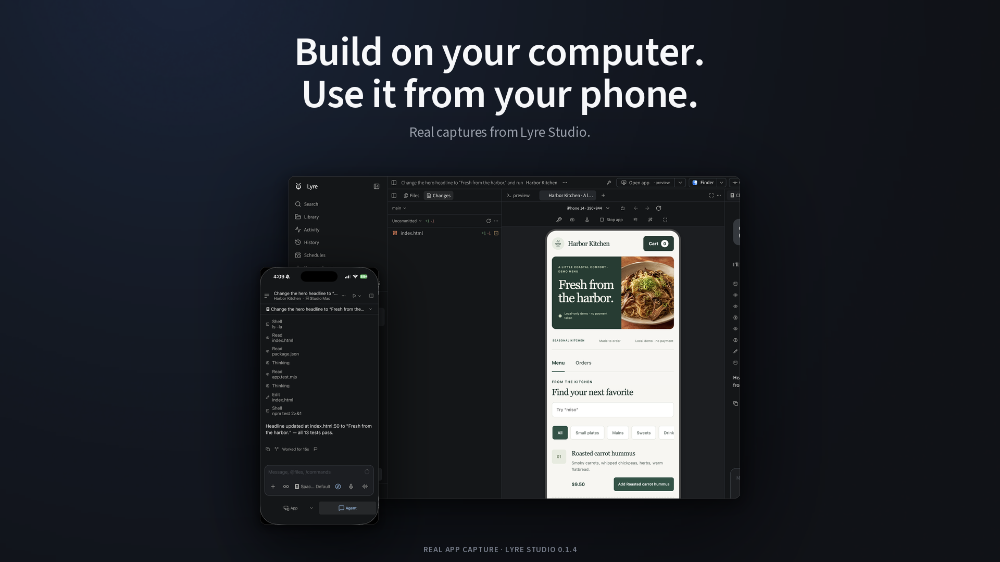
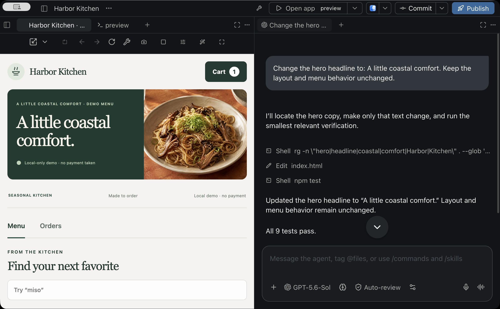
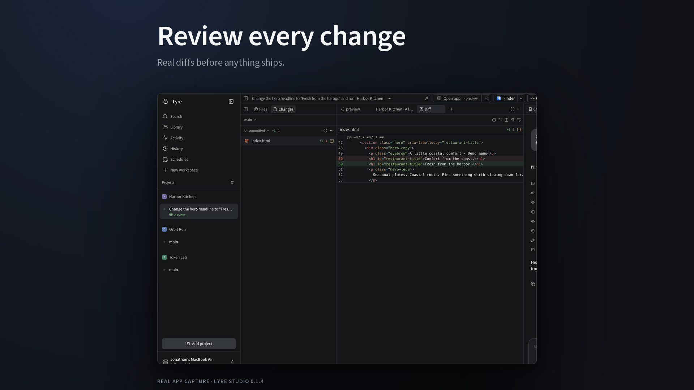
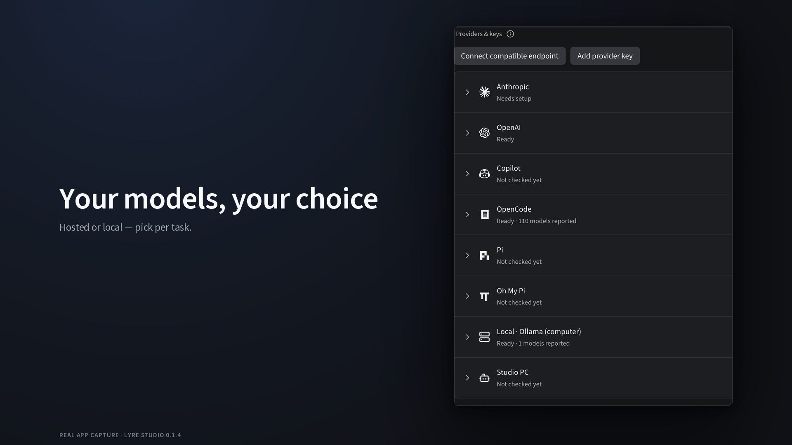
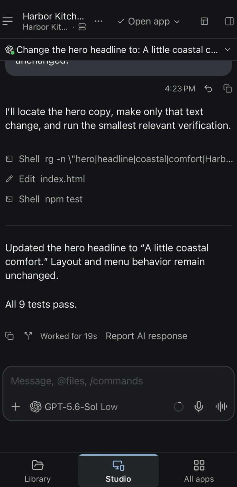
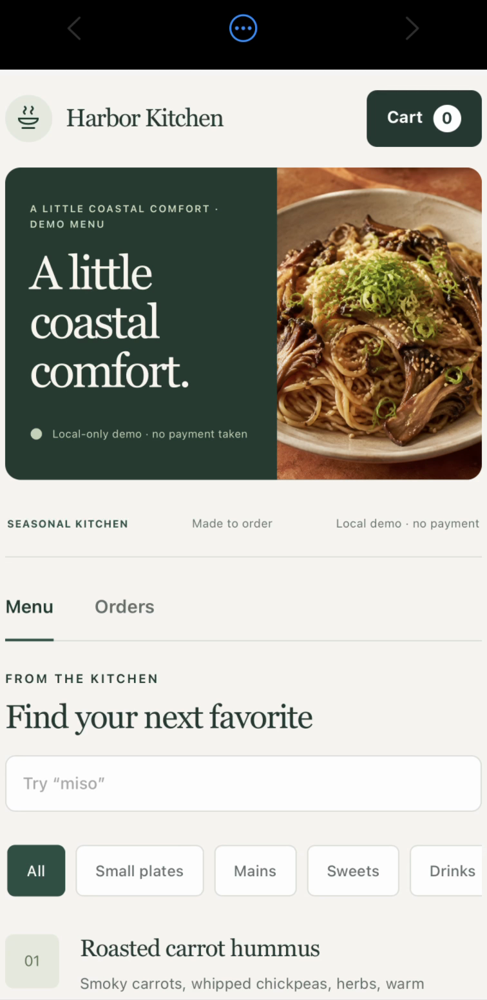
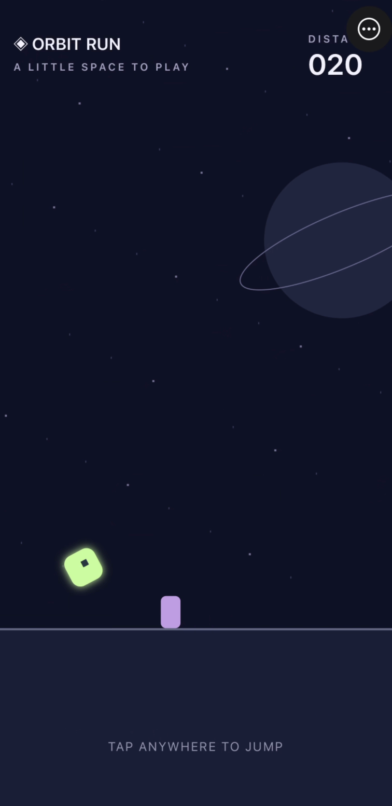

  

<h1 align="center">Lyre Studio</h1>

<strong>Build locally. Take it with you.</strong>

Coding agents, your models, and your running app, in one workspace on your computer. Drive it from your phone, tablet, or another computer.

  <a href="https://github.com/LyreStudio/lyre-releases/releases/latest"><strong>Download Lyre Studio →</strong></a> ·
  <a href="https://lyrestudio.net/docs/quickstart.html">Get started</a> ·
  <a href="https://lyrestudio.net">Website</a> ·
  <a href="https://discord.gg/eGjaBGJgp">Discord</a>

   
  macOS · Windows · Linux · Early access

  
   Real desktop and iPhone captures. Mobile clients are in testing.

<table>
  <tr>
    <td width="33%" valign="top">
      <h3>🤖 Build with agents</h3>
      Claude, Codex, Copilot, OpenCode, and Pi in one workspace, with task modes from quick questions to orchestrated work.
    </td>
    <td width="33%" valign="top">
      <h3>▶️ Try the real app</h3>
      Run your project and keep a live preview beside the conversation. Review the diff, run the tests, try the result.
    </td>
    <td width="33%" valign="top">
      <h3>📱 Take it anywhere</h3>
      Continue from a paired phone, tablet, or computer, open your whole desktop remotely, or share just the app.
    </td>
  </tr>
</table>

## Get Lyre Studio

[**Download the latest release →**](https://github.com/LyreStudio/lyre-releases/releases/latest)

| Your computer | Recommended download | Availability |
| --- | --- | --- |
| **macOS · Apple silicon** | **.dmg**: open it, then drag Lyre to Applications | Signed and notarized |
| **Windows · Intel / AMD 64-bit** | **Setup .exe** installer | Available · unsigned |
| **Linux · Intel / AMD 64-bit** | **AppImage**, or **.deb / .rpm** | Available · unsigned |

No Intel Mac package is currently published. iOS and Android clients have separate
testing and distribution channels; check [mobile availability](https://lyrestudio.net/docs/release-status.html#ios).

[Installation and updates](INSTALL.md) · [Release notes](https://github.com/LyreStudio/lyre-releases/releases) ·
[Compare plans](https://lyrestudio.net/#pricing)

## Major features

### Every agent, the right mode

Bring the coding agent you already use: **Claude Code, Codex, GitHub Copilot, OpenCode,
and Pi** run side by side, organized by project. Pick a **task mode** in the composer:

| Mode | Use it to |
| --- | --- |
| **Agent** | make the change end to end |
| **Plan** | agree on an approach before any edits |
| **Debug** | investigate a failure step by step |
| **Ask** | get an answer without touching files |
| **Multitask** | hand parts of a task to helper agents |
| **Orchestrate** | coordinate larger work across helpers and review it together |

Run independent work in separate **Git worktrees**, queue follow-up messages, dictate
by voice, and attach screenshots or files. Provider accounts, installation, and model
access vary by provider.

### Your app, live, beside the chat

Start your project's preview with **Open app** and try it next to the conversation,
or open it on its own. Agents and previews have independent lifecycles: stopping one
doesn't stop the other. Attach a preview screenshot to the next message when
something looks off.

  

### Review before you ship

Inspect every changed file in the **Changes** view, read the actual diff, and run
your project's tests in built-in **terminals**. Commit, open a pull request, or
keep iterating. A running app is something you can try; your checks decide whether
it's ready.

  

### Your models, your way

- **Cloud providers:** connect Anthropic, OpenAI, and other supported sources with
  named, host-stored key profiles or managed setup.
- **Local models:** add **Ollama, LM Studio, llama.cpp**, or a compatible server and
  use its models like any other. No model weights are bundled.
- **Routing:** browse a shared model catalog, set routes, and see a live route map
  and usage report.

Local inference depends on your hardware and the chosen agent's model support.

  

### Continue on any device

Your computer runs the projects and agents; **paired clients** pick up the same work.
Follow an agent, review its changes, try a website by touch, or play the browser
game you're building from your phone. Connect directly on your network or through an
**end-to-end encrypted relay**. The host must stay awake and connected.

  &nbsp;
  &nbsp;
  
   Direct the work. Try the website. Play the game. Earlier testing-build captures; they show the workflow, not every platform's current release.

### Your whole desktop, built in

Open a connected computer's **entire screen** from Lyre and take control, for the
tools that don't live in a browser: a game engine, a design app, a build monitor.
Remote desktop is native to Lyre, so a normal install needs **no Docker, RDP server,
gateway, or SDK**. Each session asks for consent, and pairing alone never grants
desktop access. *Early: cross-device qualification is ongoing, and support depends on
platform, permissions, and build.*

### Share the app, not the code

Invite a tester with a **single-use link or QR code**. **App-only access** lets them
use the app you shared, while source files, agent sessions, terminals, and computer
settings stay private. Revoke access at any time. For a public URL, **opt-in public
service links** require both your grant and an access token. Client support varies by
platform and plan; see [plans](https://lyrestudio.net/#pricing).

### It keeps working while you're away

**Activity** groups work that needs your input, is ready to review, or is still
running. **Schedules** run recurring agent tasks, and **notifications** tell you when
work finishes or a preview becomes ready.

## What's supported

| | Supported today |
| --- | --- |
| **Host computers** | macOS (Apple silicon), Windows 64-bit, Linux 64-bit |
| **Clients** | Lyre Studio desktop app; iOS and Android apps in testing |
| **Coding agents** | Claude Code, Codex, GitHub Copilot, OpenCode, Pi |
| **Model sources** | Provider accounts and API keys; Ollama, LM Studio, llama.cpp, and compatible local servers |
| **Connections** | Direct on your local network or VPN, or through an end-to-end encrypted relay |
| **Previews** | Web apps and browser games served by your project, on the desktop and on paired clients |
| **Remote desktop** | Built-in whole-desktop viewing and control (early) |
| **Accounts** | Local projects and local-network use need no Lyre cloud account |

<strong>More in the workspace: publishing, marketplace, plugins, and customization</strong>

- **Publish and deploy:** prepare mobile releases with integrated Fastlane tools, your
  signing setup, platform tooling, and store accounts. Setting up isn't the same as a
  completed store submission.
- **Marketplace and plugins:** browse project starters and templates, and manage
  executable host plugins. Community Extensions are a discovery catalog; extension
  installation is unavailable.
- **Guided or Developer:** choose a simpler project → chat → preview flow or a dense
  development workspace. Switching keeps your selected work and drafts.
- **Library and projects:** find recent work across computers, group projects, and
  import sessions started in a terminal.

## Your first development loop

1. **Open a project.** Choose the folder on the computer that will run it.
2. **Connect an agent or model.** Follow its installation and account setup.
3. **Make a change and try it.** Ask for a change, press **Open app**, and review the
   agent's work.
4. **Connect another device.** Use **Pair Device** with a supported client and
   explicitly grant the access it needs.

[First-project guide](https://lyrestudio.net/docs/quickstart.html) ·
[Existing projects](https://lyrestudio.net/docs/projects.html) ·
[App recipes](https://lyrestudio.net/docs/app-recipes.html)

Lyre is in early access. Capabilities depend on the installed build, provider,
platform, and configured services. [Release notes](https://github.com/LyreStudio/lyre-releases/releases)
list version-specific changes and known limitations.

## Help shape Lyre

[Report a bug](https://github.com/LyreStudio/lyre-releases/issues/new?template=bug_report.yml) ·
[Request a feature](https://github.com/LyreStudio/lyre-releases/issues/new?template=feature_request.yml) ·
[Join Discord](https://discord.gg/eGjaBGJgp) ·
[Read the docs](https://lyrestudio.net/docs/index.html)

For security issues, use [private reporting](SECURITY.md).

---

This is Lyre Studio's official repository for **downloads, release notes, and
feedback**. Application source is maintained privately. **Lyre Studio is proprietary**;
see the [license notice](LICENSE), [EULA](https://lyrestudio.net/legal/eula.txt), and
[third-party licenses](https://lyrestudio.net/legal/third-party-licenses.html).
The application foundation derives from [Paseo](https://github.com/getpaseo/paseo),
with its Apache-2.0 license and notices preserved.

© 2026 Jonathan Bakhit · Lyre Studio · <a href="https://lyrestudio.net/privacy.html">Privacy</a>

